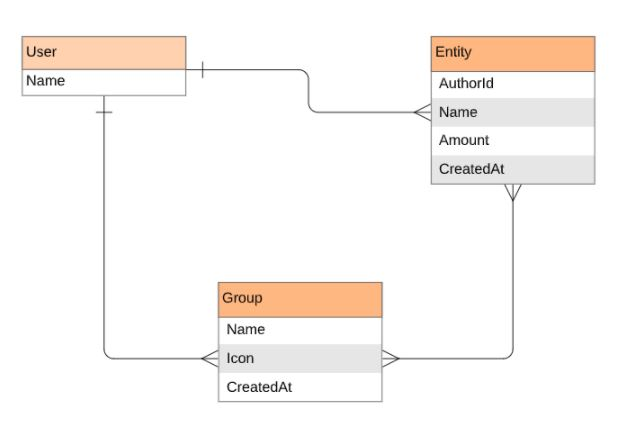

<a name="readme-top" align="center"></a>

<div align="center">
  <h1>Money Track App</h1>
  <br/>

</div>

<!-- TABLE OF CONTENTS -->

# 📗 Table of Contents

- [📖 About the Project](#about-project)
  - [🛠 Built With](#built-with)
    - [Tech Stack](#tech-stack)
    - [Key Features](#key-features)
  - [🚀 Live Demo](#live-demo)
- [💻 Getting Started](#getting-started)
  - [Setup](#setup)
  - [Prerequisites](#prerequisites)
  - [Install](#install)
  - [Usage](#usage)
  - [Run tests](#run-tests)
  <!-- - [Deployment](#triangular_flag_on_post-deployment) --> 
- [👥 Authors](#authors)
<!-- - [🔭 Future Features](#future-features) -->
- [🤝 Contributing](#contributing)
- [⭐️ Show your support](#support)
- [🙏 Acknowledgements](#acknowledgements)
- [📝 License](#license)

<!-- PROJECT DESCRIPTION -->

# 📖 Money Track <a name="about-project"></a>
Money track is a mobile web application where you can manage your budget: you have a list of transactions associated with a category, so that you can see how much money you spent and on what.

## 🛠 Built With <a name="built-with"></a>

### Tech Stack <a name="tech-stack"></a>

<details>
  <summary>Server</summary>
  <ul>
    <li><a href="https://www.ruby-lang.org/en/">Ruby</a></li>
  </ul>
</details>

<details>
  <summary>Database</summary>
  <ul>
    <li><a href="https://www.postgresql.org/">PostgreSQL</a></li>
  </ul>
</details>

<!-- Features -->

### Key Features <a name="key-features"></a>
- This Ruby on Rails application allows the user to:
   - register and log in, so that the data is private to them.
   - introduce new transactions associated with a category.
   - see the money spent on each category.

<p align="right">(<a href="#readme-top">back to top</a>)</p>

<!-- LIVE DEMO -->
## 🚀 Live Demo <a name="live-demo"></a>
[Money Track](https://money-track-qzh7.onrender.com)
[Money Track Video Demo](https://drive.google.com/file/d/1sxLs0jdFtDtLsnSEpwwM82g-_29IjKpH/view?usp=sharing)


<h2  align="center">UML Diagram<h2>
 <div align="center">
  
 </div>


<p align="right">(<a href="#readme-top">back to top</a>)</p>

<!-- GETTING STARTED -->

## 💻 Getting Started <a name="getting-started"></a>

To get a local copy up and running, follow these steps.

### Prerequisites
In order to run this project you need:

- To install ruby on your PC. You can read [this](https://rubyinstaller.org/downloads/) documentation on how to do so
- To install postgresql on your PC. You can read [this](https://www.postgresql.org/) documentation on how to do so
- Know how to navigate directories or folders at the CLI.
- Know how to get the URL(https/ssh) of a repository on GitHub.
- You should have a code editor installed, preferably VSCode
- In order to run this project you need:

### Setup
In desired folder or directory in the CLI, run the command:

```sh
git clone git@github.com:Marcraphael12/money-track-app.git
```

Navigate into the cloned folder or repository by running the command:
```sh
cd money-track-app
```

If VsCode is your default code editor, run:
```sh
code .
```

You are all set up!
### Install

Install this project with:

```sh
 bundle install
``` 
### Usage

To setup the database, run
```sh
rails db:drop
rails db:create
rails db:migrate
```

To run the project, execute the following command:

```sh
rails server
```

### Run tests

To run tests, run the following command:

```sh
bundle exec rspec
```

<p align="right">(<a href="#readme-top">back to top</a>)</p>

<!-- AUTHORS -->

## 👥 Author <a name="authors"></a>
👤 **Emmanuella Adu**

- GitHub: [@Marcraphael12](https://github.com/Marcraphael12)
- Twitter: [@MarcRaphael20](https://twitter.com/MarcRaphael20)
- LinkedIn: [Marc Raphael](http://linkedin.com/in/marc-raphael-326039204)


<p align="right">(<a href="#readme-top">back to top</a>)</p>

<!-- CONTRIBUTING -->

## 🤝 Contributing <a name="contributing"></a>

Contributions, issues, and feature requests are welcome!

Feel free to check the [issues page](https://github.com/Marcraphael12/money-track-app/issues).

<p align="right">(<a href="#readme-top">back to top</a>)</p>

<!-- SUPPORT -->

## ⭐️ Show your support <a name="support"></a>

If you like this project give us a ⭐

<p align="right">(<a href="#readme-top">back to top</a>)</p>

<!-- ACKNOWLEDGEMENTS -->

## 🙏 Acknowledgments <a name="acknowledgements"></a>

I would like to thank [Microverse](https://github.com/microverseinc) for this project inspiration and Gregoire Vella for UI for this project.

<p align="right">(<a href="#readme-top">back to top</a>)</p>

<!-- LICENSE -->

## 📝 License <a name="license"></a>

This project is [MIT](./LICENSE) licensed.


<p align="right">(<a href="#readme-top">back to top</a>)</p>
